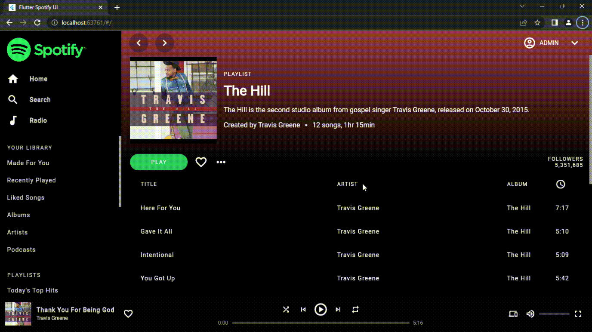

# Flutter Spotify Clone

This project is a Spotify clone built using the Flutter SDK. 
It's a web application that mimics the user interface of the Spotify app. 

## Features
- Browse and play songs
- Create and view playlists
- Search for songs and playlists
- Responsive design for various screen sizes.

## Getting Started

1. Clone the repository
   https://github.com/whoIsOneZero/spotify_clone.git

2. Install the dependencies
flutter packages get

3. Run the project
flutter run -d chrome

## Note
The backend is not implemented and dummy data is used instead.
